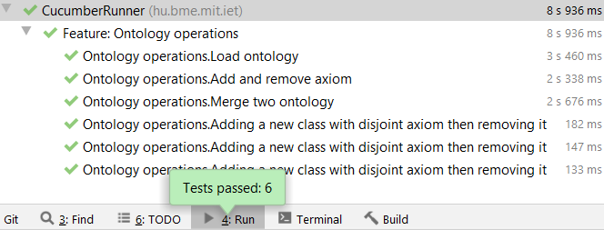

# BDD Tesztek végzése Cucumberrel

A BDD tesztelés viszonylag új volt számunkra így a feladatot különböző tutorial sorozatok tanulmányozásával kezdtük, ahol méyebb betekintést nyerhettünk a BDD tesztelés világába, valamint sokat megtudtunk Cucumber használatának részleteiről.

## Tesztesetek:

* **Scenario:** Load ontology
    
    * Teszteset leírása: A teszt során betöltünk egy ontológiát, és annak sikerességét vizsgáljuk.
    
    * Elvárások:
        * A betöltött ontológia megfelelő mennyiségű axiómát tartalmazzon.
        * A betöltött ontológia megfelelő mennyiségű logikai axiómát tartalmazzon.
        * A betöltött ontológia megfelelő formátumú legyen.
        
* **Scenario:** Add and remove axiom
    
    * Teszteset leírása: A teszt során betöltünk egy ontológiát, majd ahhoz adunk hozzá egy Subclass kapcsoltot két már létező osztály között, majd ezt a kapcsolatot eltávolítjuk.
    
    * Elvárások:
        * A kapcsolat hozzáadása után az ontológiában szereplő axiómák száma egyel növekedjen.
        * A kapcsolat eltávolítása után az ontológiában szereplő axiómák száma egyel csökkenjen.

* **Scenario:** Merge two ontologies
    
    * Teszteset leírása: A teszt során betöltünk egy ontológiát, majd ahhoz hozzámergelünk egy másik ontológiát.
    
    * Elvárások:
        * A mergelés után kapott ontológiában található axiómák száma a két ontológia axiómáinak számának összegével egyezzen meg.

* **Scenario Outline:** Adding a new class with disjoint axiom then removing it

    * Teszteset leírása: A teszt során betöltünk egy ontológiát, majd hozzáadunk egy új osztályt disjoint kapcsolattal egy már az ontológiában szereplő osztállyal. Ezek után a hozzáadott osztályt eltávolítjuk az ontológiából a hozzátartozó axiómákkal együtt.
        * Ez a teszteset annyiban különbözik a többitől, hogy itt a Scenario Outline funkciót próbáltuk ki, ahol lehetőség van az adott Scenario-t lefuttatni egymás után több paraméterrel is. Jelen esetben a tesztelés nem követeli meg ennek használatát, csupán tapasztalat szerzés céljából használtuk. Ez a funkció hasznos lehet egy olyan tesztesethez, ahol például a bejelentkezéshez szükséges adatok megadását teszteljük.
        
    * Elvárások:
        * Hozzáadás után az ontológiában szereplő axiómák száma növekedjen egyel.
        * Hozzáadás után az ontológiában már eddig is szereplő osztály disjoint kapcsolattal rendelkező osztályainak száma növekedjen egyel.
        * Eltávolítás után az ontológiában szereplő axiómák száma csökkenjen egyel.
        * Eltávolítás után az ontológiában már eddig is szereplő osztály disjoint kapcsolattal rendelkező osztályainak száma csökkenjen egyel.

#### Tesztesetek futásának eredménye:
