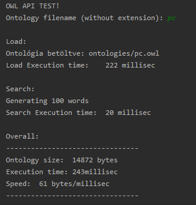
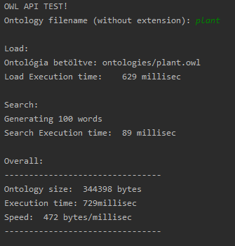
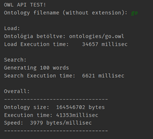

# Nem funkcionális tesztelés

# Az általunk vizsgált részek:
* **Stressz teszt**
* **Teljesítmény teszt**
# A tesztek megvalósítása
A kettő tesztet egy általunk (java) nyelven írt programban teszteltük, ahol a következő események hatására adott válaszokat vizsgáltuk:
* ontológiák betöltésének ideje az ontológiák méretétől függően
* ontológiák feldolgozásának ideje a mérettől függően
* a keresés ideje az ontológia méretétől függően (keresés véletlenszerű szavakkkal és az ontológiában megtalálható szavakkal is)
    
    Mindezen tesztek alatt a háttérben figyeltük a memóri illetve a CPU kihasználtságot, azonban itt sajnos jelentős eltérés nem volt tapasztalható a fordítókörnyezet alap CPU illetve memóriakihasználtsága miatt, ezért ezeket képernyőképeket kihag

## A tesztelt esetek:
* **Kis ontológiát használva (nem véletlenszerű szavakkal):**

    

    **Következtetés:** Látható, hogy kis ontológiát használva gyors a betöltési idő továbbá a keresési idő is alacsony.
    A véletlenszerű szavakkal végzett tesztelés itt nem mutatott nagy eltérést, mivel nem volt 100 szó az ontológiában, így, hogy a tesztesetek hasonló körülményekkel legyenek lefolytatva, mellégeneráltunk további véletlenszerű szavakat.

* **Nagyobb ontológiát használva (nem véletlenszerű szavakkal):**

    

    **Következtetés:** Itt már növekszik a feldolgozási illetve keresési idő is. Azonban mint látható még nem kapunk nagy eltérést az előző teszthez képest.
    Itt a véletlenszerű tesztesteknél már nagy különbség tapasztalható, mivel itt már megfelelő mennyiségű adat áll rendelkezésre, ahhoz hogy 100 ontológiával is tudjuk tesztelni az adott tesztesetet.

* **Nagy ontológiát használva (nem véletlenszerű szavakkal):**
       
    

    **Következtetés:** Itt már látszódik, hogy exponenciálisan növekszik a betöltési idő, azonban az itt tapasztalható sebesség növekedés csak annak tudható be, hogy itt kisebb az overhead a a program futtatása, a véletlenszerű szavak generálása és kiolvasása miatt. Innen látszódik, hogy a program nincsen felkészítve a hatalmas (100 MB-nél nagyobb) file-ok kezelésére (például többszálú folyamatokkal és egyéb teljesítménygyorsító megoldásokkal). Ezeket a későbbiekben javítani lehet, azonban megjegyzendő, hogy még itt sem fagyott le illetve crash-elt el a program. 
