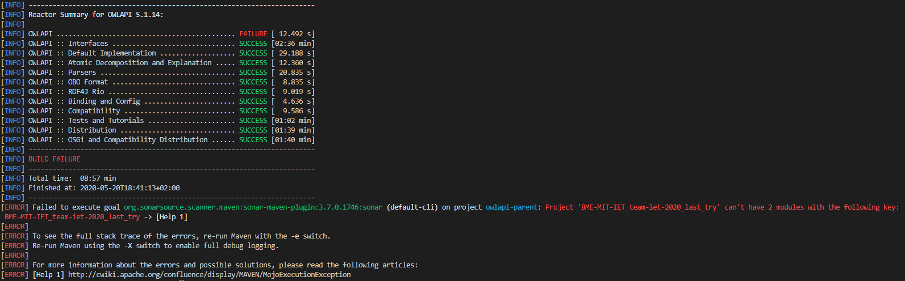
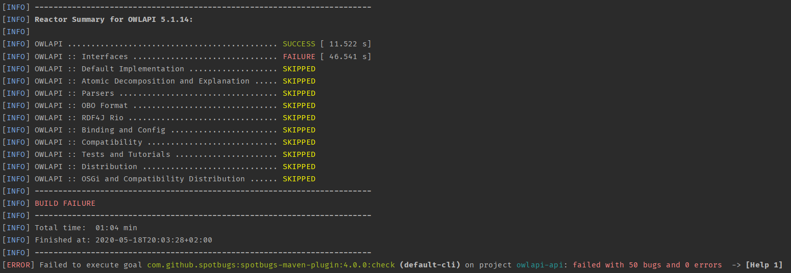

# Statikus analízis eszköz futtatása és jelzett hibák átnézése (SonarQube, SpotBugs, VS Code Analyzer, Codacy, Coverity Scan...)

## Általunk használt eszközök:
* **SonarCloud:** A program működét sajnos nagy erőfeszítések ellenére sem sikerült elérni még külső segítséggel sem. A buildelés sikertelen volt és az alábbi hibakódot kaptuk:

    
    * A hibák megoldásának folyamatát a feladathoz tartozó issue-nál lehet nyomon követni.

* **SonarQube:** A legtöbb hibát ez alapján sikerült detektálnunk.

    

* **SpotBugs:** Kipróbáltuk ezt is, viszont ez sajnos elakadt, így nem futott le a teljes ellenőrzés:

    


## Statikus analízis eszközökkel talált hibák:

* **Felesleges feltétel a ciklusban:** Olyan feltételt adtak meg, ami mindig true-ra vagy false-ra értékelődik ki.

    ```java
    ZipEntry entry = null;
    ZipEntry nextEntry = zis.getNextEntry();
    while (entry != null && nextEntry != null) {
        ...  //itt sem változtat érdemlegeset a feltételen
    }
    ```

* **Erőforrás nincs megfelően lezárva Exception esetén:** Célszerűbb lenne finally blokkban bezárni az erőforrást.

    ```java
    BufferedReader r = new BufferedReader(new InputStreamReader(new FileInputStream(
                "../OWLAPI3/tutorial2011/uk/ac/manchester/owl/owlapi/tutorialowled2011/TutorialSnippets.java")));
    String line = r.readLine();
    while (line != null) {
    ...
    }
    r.close();
    ```

* **Konstans stringek használata:** A hibadobások szövegét ki lehetne szervezni publikus konstansokba.

    ```java
    checkNotNull(object, "object cannot be null");
    ```

* **Nem használt importok eltávolítása:** `OWLImmutableOntologyImpl.java` fájl 115 nem használt importot tartalmaz.
* **Tesztek nem megfelelő paraméterezése:** `OWLObjectTypeIndexProviderTestCase.java` fájlban a kapott és a várt érték nem a megfelelő sorrendben van átadva.

    ```java
    assertEquals(b.asymm().typeIndex(), 2018);
    ```

* **String egyenlőség nem megfelelő vizsgálata:** `!=` helyett `.equals()` kellene.

    ```java
    public boolean handlesMimeType(String mimeType) {
        String type = mimeType;
        ...
        for (String nextMimeType : getMIMETypes()) {
            ...
            if (mimeType != type && type.equalsIgnoreCase(nextMimeType)) {
                return true;
            }
        }
        ...
    }
    ```

* **NullPointerException:** Publikus API-knál érdemes lenne kezelni a NullPointerException-öket.

    ```java
    @Override
    public boolean containsEntityInSignature(OWLEntity owlEntity) {
        return ontsignatures.get(this).contains(owlEntity);
    }
    ```
